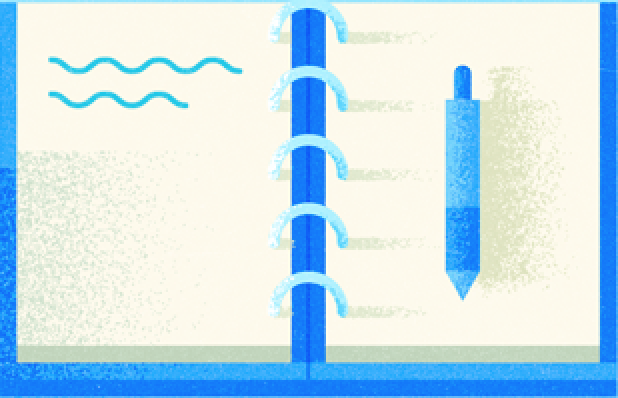

import { Section, Button,ImageContainer } from "@robinguan/gatsby-mdx-mui-theme"

<Section background={"#D0CDE1"}>
<ImageContainer width={'50%'}>

</ImageContainer>
<h4>Project Name</h4>

A web application to help sdevelopers and programmers build beautifully designed portfolios in minutes 

<Button color={'primary'} href={'https://www.google.com/'}>Hello</Button>
</Section>

<Section background={"#fff"}>
<ImageContainer width={'50%'}>

</ImageContainer>
<h4>Project Name</h4>

A web application to help sdevelopers and programmers build beautifully designed portfolios in minutes 

<Button color={'primary'} href={'https://www.google.com/'}>Hello</Button>
</Section>

<Section background={"#D0CDE1"}>
<ImageContainer width={'50%'}>

</ImageContainer>
<h4>Project Name</h4>

A web application to help sdevelopers and programmers build beautifully designed portfolios in minutes 

<Button color={'primary'} href={'https://www.google.com/'}>Hello</Button>
</Section>