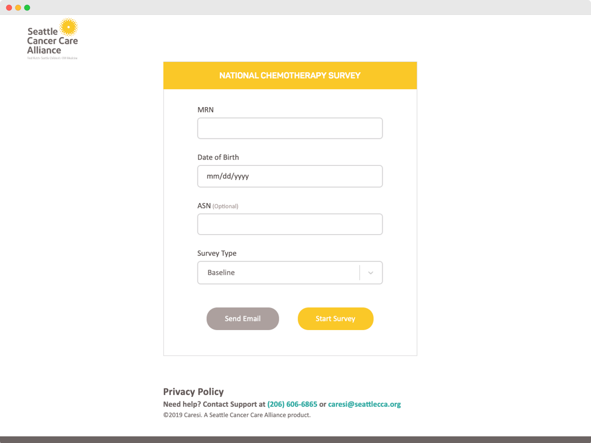
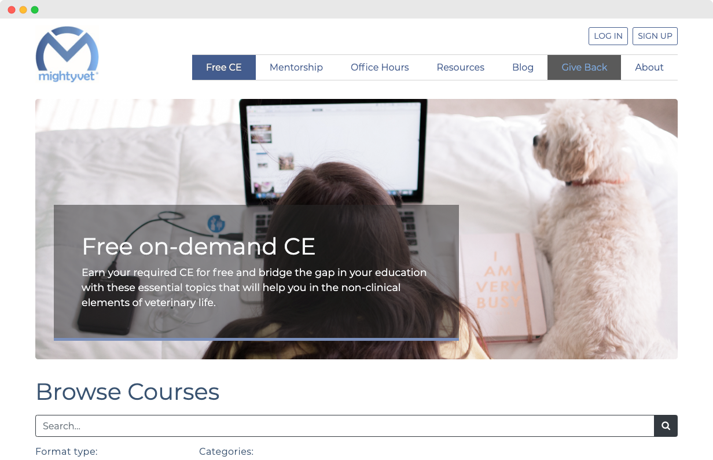
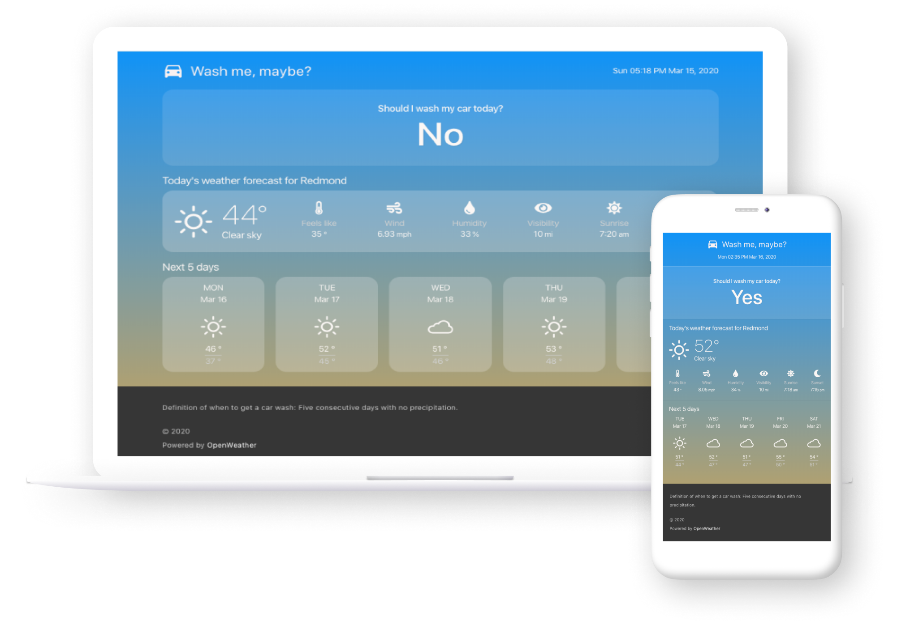
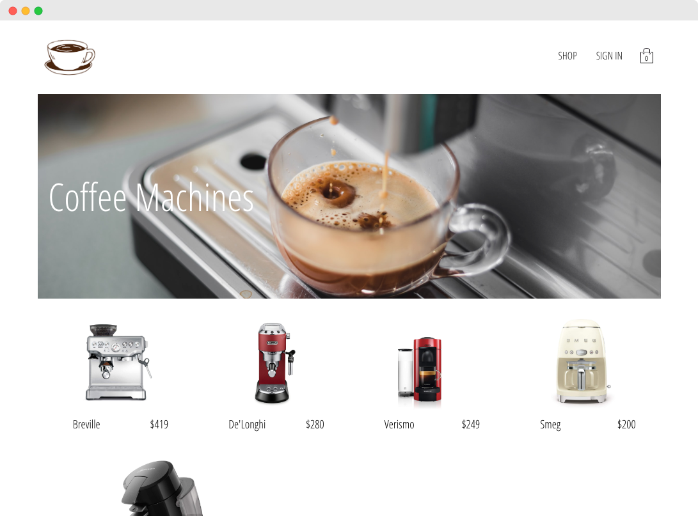
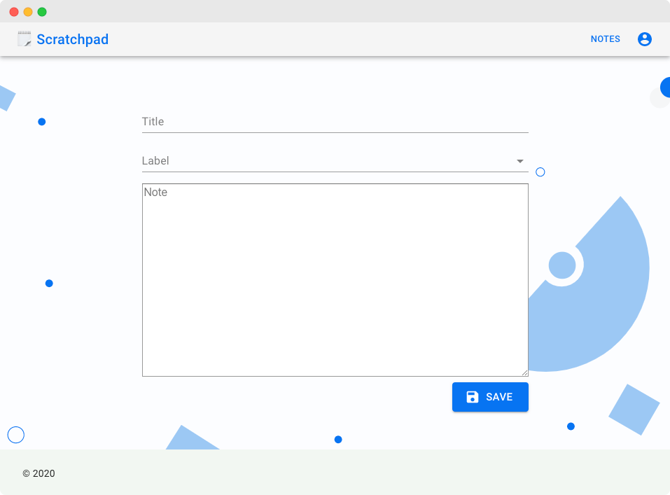
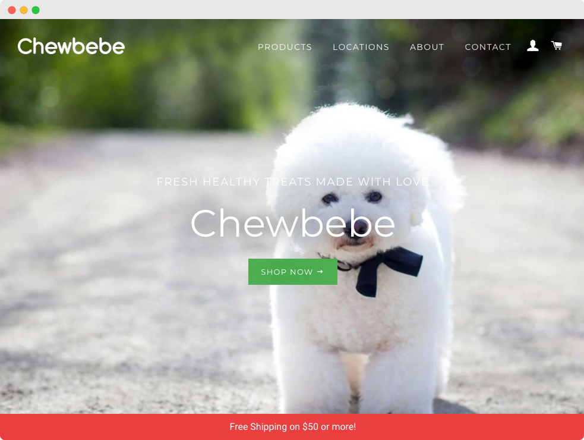
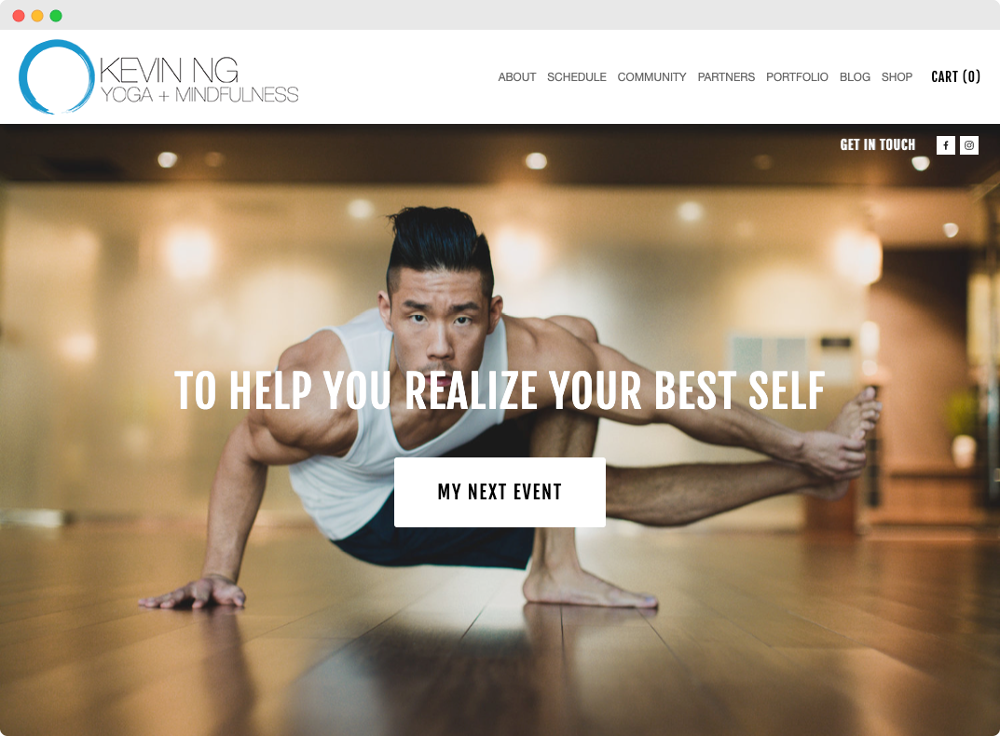

import { Section, Button, ImageContainer, TwoColumnsGrid, FourColumnsGrid, Chips, Buttons } from "@robinguan/gatsby-mdx-mui-theme"

<Section background={"#D0CDE1"}>
<TwoColumnsGrid left={<ImageContainer width={'100%'} border={1} borderColor={'#D0CDE1'}>

</ImageContainer>} right={

<h6>🏥 Seattle Cancer Care Alliance</h6>

Two major products I worked on, web-based applications written in React and Redux for patients to view appointments, complete surveys, and review lab results. Improved patient response rate and overall user experience, a microservice for scheduling patients' surveys based on their appointments, disease groups, and other business requirements.

<Chips chips={['React', 'Redux', 'Sass', 'JavaScript', 'AWS Lambda', 'Postgres', 'Severless Architecture', 'Jest', 'Mocha', 'Chai']} />
} />
<Buttons buttons={[{label:'Visit Site', color:'primary', href:'https://caresi.seattlecca.org'}]} />
</Section>

<Section background={"#fff"}>
<TwoColumnsGrid right={<ImageContainer width={'100%'} >

</ImageContainer>} left={

<h5>📏 Net-Inspect</h5>

Designed and implemented 3 major modules in a suite of web-based supply chain management tools. Brainstormed, prototyped, and created data-driven interactive charts; transformed complex concepts and data into visually engaging information according to modern design principles. Collaborated with business stakeholders and the engineering team to develop project requirements.

<Chips chips={['User Interface Design', 'User Experience Design', 'Product Owner', 'Front-end Development', 'wireframes', 'design docs', 'functional specifications']} />
} />

<Buttons buttons={[{label:'Visit Site', color:'primary', href:'https://www.net-inspect.com'}]} />
</Section>

<Section background={"#D0CDE1"}>
<TwoColumnsGrid left={<ImageContainer width={'100%'} border={1} borderColor={"#D0CDE1"}>

</ImageContainer>} right={

<h5>🐶 MightyVet</h5>

A website for helping veterinary workers tackle issues in their profession and community. Features include the ability for veterinarians to host, schedule, and attend courses or support groups online.

<Chips chips={['Angular','Node.js', 'Express.js', 'MongoDB', 'Stripe', 'Bootstrap']} />
} />
<Buttons buttons={[{label:'Visit Site', color:'primary', href:'https://mightyvet.org'}, {label:'Github', color:'secondary', href:'https://github.com/mighty-vet/MightyVet'}]} />
</Section>

<Section background={"#ffffff"}>
<TwoColumnsGrid right={<ImageContainer width={'100%'}>

</ImageContainer>} left={

<h5>🚘 Wash me, maybe?</h5>

This app solves the age-old problem of washing your car only to have it rain the very next day. This simple app runs across all browsers and mobile devices. By using the magic of GPS and online weather forecasts, <b>Wash me, maybe?</b> will automatically give a simple Yes/No answer on whether you should wash your car today. Additionally, the app shows you a 5-day precipitation forecast to help you plan your next car wash!

<Chips chips={['React','Gatsby','Sass','Open weather API', 'Geolocation API']} />
} />
<Buttons buttons={[{label:'Visit Site', color:'primary', href:'https://washmemaybe.com'}, {label:'Github', color:'secondary', href:'https://github.com/RobinRobinG/car-wash'}]} />
</Section>

<Section background={"#D0CDE1"}>
<TwoColumnsGrid left={<ImageContainer width={'100%'} border={1} borderColor={'#D0CDE1'}>

</ImageContainer>} right={

<h5>🛒 E-commerce</h5>

An online shopping experience with shopping cart, checkout, and  customer sign up/log in. Designed to be responsive, it runs on all browsers and mobile devices. Built with React front-end, Firebase is used for storing user and shop data.

<Chips chips={['React', 'Redux', 'Node.js', 'Express.js', 'Firebase', 'Stripe']} />
} />
<Buttons buttons={[{label:'Visit Site', color:'primary', href:'https://some-random-shopping-site.herokuapp.com'}, {label:'Github', color:'secondary', href:'https://github.com/RobinRobinG/ecommerce-react-app'}]} />
</Section>

<Section background={"#fcfcfc"}>
<TwoColumnsGrid right={<ImageContainer width={'100%'} border={1} borderColor={'primary.light'}>

</ImageContainer>} left={

<h5>🗒️ Scratchpad</h5>

A simple app for taking notes anywhere, whether on your laptop or on your phone. Users can create multiple boards to organize their notes, and these boards can be shared with other users. Built with React and Material-Ui on the front-end, AWS Lambda for backend APIs, and DynamoDB for storing user data.

<Chips chips={['React', 'Material-Ui','AWS Lambda', 'API Gateway', 'DynamoDB']} />
} />
<Buttons buttons={[{label:'Visit Site', color:'primary', href:'https://affectionate-easley-62f1fb.netlify.com/board/6a68a15b-641d-4749-84b9-7467498042b8'}, {label:'Github', color:'secondary', href:'https://github.com/RobinRobinG/some-new-page'}]} />
</Section>

<Section background={"#D0CDE1"}>
<TwoColumnsGrid left={<ImageContainer width={'100%'} border={1} borderColor={'#D0CDE1'}>

</ImageContainer>} right={

<h5>🍪 Chewbebe</h5>

An e-commerce site for promoting healthy treats for all dogs and cats. The specifications of the project included creating the branding, packaging, and all other marketing related materials for the company, as well as all of the front-end web design and implementation. The site is built on Shopify, an e-commerce CMS platform to make future updates and maintenance easier for the client.

<Chips chips={['Shopify', 'HTML', 'CSS', 'JavaScript', 'Marketing', 'SEO', 'Visual Design', 'Illustration']} />
} />
<Buttons buttons={[{label:'Visit Site', color:'primary', href:'https://www.chewbebe.com'}]} />
</Section>

<Section background={"#fcfcfc"}>
<TwoColumnsGrid right={<ImageContainer width={'100%'} border={1} borderColor={'primary.light'}>

</ImageContainer>} left={

<h5>🧘🏻 Kevin Ng Yoga</h5>

A site for a yoga instructor Kevin Ng to showcase his work and events. Features include a calendar to show all upcoming events, albums to display highlights and photos from all past events, a newsletter signup form, and a shop for merchandise.

<Chips chips={['Squarespace', 'HTML','CSS', 'JavaScript']} />
} />
<Buttons buttons={[{label:'Visit Site', color:'primary', href:'https://www.kevinngyoga.com/'}]} />
</Section>
